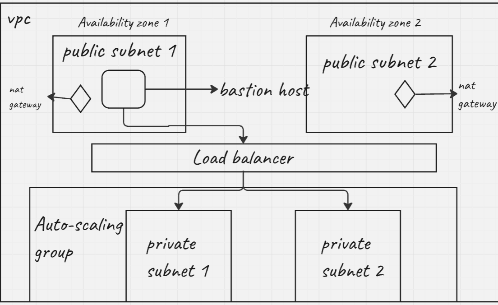
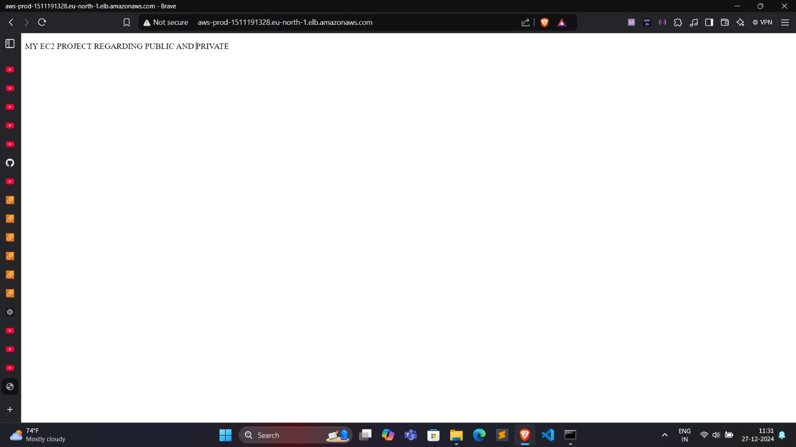
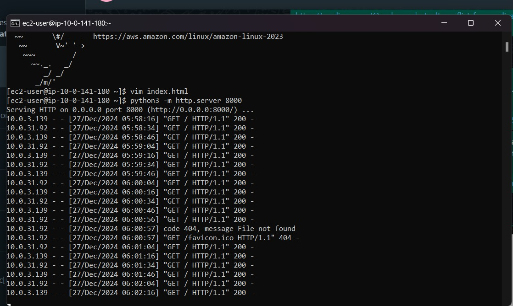

# SecuredVPC

#### So In this project I am going to show like how we can we host a secure server in AWS Cloud.

### Step 1 {Architecture}

#### Firstly, Firstly let's see the architecture diagram below -



### Step 2 {Overview}

#### So, we are going to create a VPC that you can use for your severs deployment. Then in the same VPC server we are going to deploy servers in two availability Zones, by using Auto Scaling Groups and an Application Load Balancer. For additional security, we are going to deploy our servers in private subnets. The servers receive requests through the load balancer. The servers can connect to the internet by using a NAT gateway. To improve resiliency, we deploy the NAT gateway in both Availability Zones.

### Step 3 {Configuring VPC}

#### We named our VPC and create our VPC with 2 Availability Zones, then we add 2 private subnets , for NAT gateways we add "1 per AZ" so now we have a NAT gateway at each availability zone.

### Step 4 {AutoScaling Groups}

#### So to start work with AutoScaling we are going to make a Launch Template first, we name our launch template then added some description about our launch template, select an image for our servers I choose AMI then we choose a key pair choose one you have in our system or create new key pair. Then you create a new security group where we are going to select our VPC which we configured before, then we add some inbound security rules, so first we want to access our server so we opened ssh port 22. then the other port we need for is our server so I am going to host my server on port 8000 we also opened port 8000 custom TCP from anywhere IPv4. After that we created our launch template.

### Part 2

#### Then we are going to make AutoScaling Group now after giving name we selected our launch template, after that move on to step 2 where we selected our VPC which we configured.Then we want our server to be hosted safely so we selected the private subnets.Then we move on to step 3 where we currently marked to default No load balancer because we are going to add it on later stage seperately. We move on to step 4 where we tell our group size so I gave maximum capacity 4 and minimum capacity 1 and since we have two private subnets I give desired capacity as 2. Then we just create our AutoScaling Group.

### Step 5 {Bastion Host}

#### Next, we go to EC2 check our previous created 2 servers which are secure currently so to access those two secure servers I created a bastion host {ec2 server} within the same VPC and one of the public subnet through this we can access our private subnets.Then we just create our bastion host.

### Step 6 {Added key name into our Bastion Host}

#### Now, through our SSH we loggined Bastion Host and using the command

```
 scp -i "address of key name .pem" "address of key name .pem file" ec2-user@bastionpublicip:/home/ec2-user/home
```

#### so to access this home you firstly have to login into your bastion ip and make a folder name home then exceute the above command so that the say key name pair .pem file is no being added to your bastion host the reason to add this to your bastion host because using this .pem file you can access your private subnets which contain servers because they also have the same key name pair

### Step 7 {Start server}

#### With the help of key pair present in bastion host you can access the private servers using their private IP address and you can now start a new server. For this I started an python server running on port 8000

### Step 8 {Configuring Load Balancer}

#### Now, we are going to make a application load balancer, within the same VPC and in Public subnet (automatically it is looking for public subnet only), then we add our security groups after that we are going to make our target group where we choose instances , then add the port of 8000 because there our server is running then we deploy our load balancer.

### Step 9 {Setup Complete}

#### Now you can run you application in Internet , even through you cannot directly access the server and make changes to it.

### ScreenShots





#### Thank you

#### With Regards

#### Aryan Rana

### If you have more improvements to this feel free to contribute
